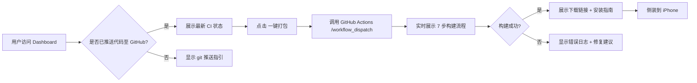

# 乘风AI IPA 打包工具 - 产品需求文档 (PRD)

## 1. Product Overview

一款**网页版 iOS IPA 打包工具**，帮助 Windows 用户在不安装 Xcode 的情况下，通过 GitHub Actions 自动打包 iOS 应用并生成可侧装的 IPA 文件。

- 核心目标：将 iOS 构建流程可视化、自动化，让非 Mac 用户也能完成 IPA 打包
- 目标用户：Windows 开发者、iOS 测试人员、希望侧装应用的用户
- 产品价值：一次配置，自动完成 源代码 → Archive → IPA → Release 全流程

## 2. Core Features

### 2.1 Feature Module

1. **首页 Dashboard**：项目状态概览、最近构建历史、快速操作区
2. **构建流程可视化 Build Pipeline**：分步展示打包过程、实时状态、错误排查
3. **安装指南 Installation Guide**：Sideloadly/AltStore/TrollStore 多方式侧装说明
4. **配置检查 Configuration Checker**：验证 project.yml / Info.plist / CI 配置完整性

### 2.2 Page Details

| Page Name | Module Name | Feature Description |
|-----------|-------------|---------------------|
| Dashboard | Hero section | 项目名称、版本号、最新构建状态徽章、一键打包按钮 |
| Dashboard | Build history | 时间线式展示最近 5 次构建结果、耗时、产物大小 |
| Build Pipeline | Step indicator | 7 步可视化：代码准备 → XcodeGen → 模拟器构建 → 真机 Archive → IPA 打包 → Artifact 上传 → Release |
| Build Pipeline | Log viewer | 实时显示构建日志高亮、错误标红、可折叠的详细输出 |
| Installation Guide | Method cards | 三种侧装方式卡片（Sideloadly/AltStore/TrollStore），含下载链接与步骤 |
| Installation Guide | Video tutorial | 内嵌视频/图文教程、常见问题 FAQ |
| Config Checker | Validation | 扫描并验证 project.yml、Info.plist、Package.swift、ci.yml 关键配置项 |

## 3. Core Process

## 4. User Interface Design

### 4.1 Design Style

- **主色调**：深空蓝 `#0B1F3A` + 霓虹青 `#00E5FF`（科技感，符合开发者工具调性）
- **辅助色**：成功绿 `#10B981` / 警示橙 `#F59E0B` / 错误红 `#EF4444`
- **按钮风格**：大圆角 16px、实心渐变、悬停时发光、点击下沉
- **字体**：`JetBrains Mono`（等宽，代码感） + `Inter`（正文）
- **布局**：左侧侧栏导航 + 右侧主内容区，卡片悬浮带阴影
- **图标风格**：Lucide Icons，线性简洁风格
- **背景**：深色毛玻璃 + 细微网格纹理 + 渐变光晕

### 4.2 Page Design Overview

| Page Name | Module Name | UI Elements |
|-----------|-------------|-------------|
| Dashboard | Hero | 大号项目标题、动态状态徽章、CTA 按钮带脉冲动画、左右光晕 |
| Dashboard | Build history | 时间线卡片，每卡片含：图标 + 状态 + 日期 + 构建号 + 大小，悬停浮动 |
| Pipeline | Steps | 垂直步骤条，当前步骤脉冲高亮，已完成打绿色对勾，未开始灰色 |
| Pipeline | Log viewer | 深色终端风格，等宽字体，错误行红色高亮 |
| Install Guide | Cards | 三栏卡片布局，卡片内：标题图标 + 简介 + 步骤列表 + 下载按钮 |
| Config Check | Validator | 扫描报告，逐项显示 Pass/Warn/Fail，可展开问题说明 |

### 4.3 Responsiveness

- 桌面端（1280px+）：三栏完整布局，左侧导航 + 主内容 + 右侧目录
- 平板端（768px+）：两栏布局，侧栏折叠为图标
- 移动端（<768px）：单栏流式，顶部汉堡菜单，内容卡片堆叠

### 4.4 Motion & Animation

- 页面加载：整页渐入 + 卡片错位淡入（staggered 80ms）
- 构建步骤：步骤切换时有从左向右的光晕扫描动画
- 状态变化：成功 / 失败时的图标弹跳 + 颜色过渡
- 悬停交互：按钮上浮 + 阴影增强，卡片边框发光

---

*文档版本: v1.0 · 更新时间: 2026-06-16*
