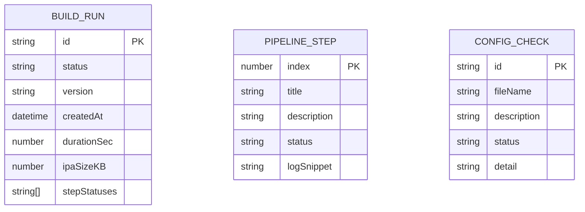

# 乘风AI IPA 打包工具 - 技术架构文档

## 1. Architecture Design

```mermaid
flowchart TB
    subgraph Frontend["🌐 前端 (React + Vite)"]
        A1[Dashboard 组件]
        A2[Pipeline 构建流程组件]
        A3[Installation Guide 组件]
        A4[Config Checker 组件]
        A5[状态管理 Zustand]
    end

    subgraph Data["📦 数据层"]
        D1[本地 mock 数据 - 构建历史]
        D2[静态配置 - project.yml / ci.yml]
        D3[GitHub Actions API (可选)]
    end

    subgraph External["🔗 外部服务"]
        E1[GitHub Actions CI/CD]
        E2[GitHub Release / Artifacts]
        E3[Sideloadly / AltStore (用户侧)]
    end

    A1 --> A5
    A2 --> A5
    A3 --> A5
    A4 --> A5
    A5 --> D1
    A1 --> E1
    A2 --> E1
    A3 --> E2
    A4 --> D2
```

## 2. Technology Description

| 层级 | 技术选型 | 版本 | 说明 |
|------|---------|------|------|
| 前端框架 | React | 18.x | 组件化开发，状态易管理 |
| 构建工具 | Vite | 5.x | 极速 HMR，构建产物小 |
| 语言 | TypeScript | 5.x | 类型安全，IDE 友好 |
| UI 样式 | Tailwind CSS | 3.x | 原子化 CSS，快速构建 |
| 状态管理 | Zustand | latest | 轻量、API 简洁 |
| 图标 | lucide-react | latest | 简洁线性图标 |
| 路由 | react-router-dom | 6.x | 多页面导航 |
| 动画 | 原生 CSS + Framer Motion | latest | 流畅过渡效果 |
| **后端** | **无** | - | 纯前端静态页面，无需后端 |
| **数据库** | **无** | - | 构建历史用本地存储 / 静态 mock |

> 设计原则：本工具为**纯前端**展示与交互页面，所有构建逻辑由 GitHub Actions 执行；页面仅做配置展示、流程指引、状态可视化。

## 3. Route Definitions

| 路由 | 页面 | 主要内容 |
|------|------|---------|
| `/` | Dashboard | 项目概览、最新构建、快速操作 |
| `/pipeline` | Build Pipeline | 7 步构建流程可视化、日志查看 |
| `/install` | Installation Guide | 三种侧装方式详细说明 |
| `/config` | Config Checker | 项目配置完整性检查 |

## 4. Component Hierarchy

```
src/
├── App.tsx                      # 根组件 + 路由配置
├── main.tsx                     # 入口
├── index.css                    # Tailwind + 自定义样式
├── components/
│   ├── layout/
│   │   ├── Sidebar.tsx          # 左侧导航栏
│   │   ├── LayoutContainer.tsx  # 通用布局容器
│   │   └── StatusBadge.tsx      # 状态徽章（成功/失败/进行中）
│   ├── dashboard/
│   │   ├── HeroSection.tsx      # 英雄区 + 一键打包 CTA
│   │   ├── BuildHistory.tsx     # 构建历史时间线
│   │   └── StatsCards.tsx       # 统计卡片（构建次数/成功率/平均耗时）
│   ├── pipeline/
│   │   ├── StepIndicator.tsx    # 步骤指示器
│   │   ├── LogViewer.tsx        # 日志查看器（终端风格）
│   │   └── PipelineCard.tsx     # 单个步骤卡片
│   ├── install/
│   │   ├── MethodCard.tsx       # 侧装方式卡片
│   │   └── FAQSection.tsx       # 常见问题折叠面板
│   └── config/
│       ├── CheckReport.tsx      # 检查报告
│       └── CheckItem.tsx        # 单项配置检查结果
├── pages/
│   ├── DashboardPage.tsx
│   ├── PipelinePage.tsx
│   ├── InstallPage.tsx
│   └── ConfigPage.tsx
├── store/
│   └── useBuildStore.ts         # Zustand store - 构建状态管理
├── data/
│   ├── mockBuilds.ts            # mock 构建历史数据
│   ├── installGuides.ts         # 安装指南内容
│   └── configChecks.ts          # 配置检查规则
└── utils/
    └── formatters.ts             # 时间/文件大小格式化工具
```

## 5. Core Data Model



### 5.1 TypeScript 类型定义

```typescript
// 构建状态
type BuildStatus = 'success' | 'failed' | 'running' | 'pending'

// 单次构建记录
interface BuildRecord {
  id: string
  version: string
  status: BuildStatus
  createdAt: Date
  durationSec: number
  ipaSizeKB: number
  steps: PipelineStep[]
}

// 构建步骤
interface PipelineStep {
  index: number
  title: string
  description: string
  status: BuildStatus
  logSnippet: string
}

// 配置检查项
interface ConfigCheckItem {
  id: string
  fileName: string
  description: string
  status: 'pass' | 'warn' | 'fail'
  detail: string
}

// 侧装方式
interface InstallMethod {
  id: string
  title: string
  description: string
  downloadUrl: string
  steps: string[]
  platforms: ('windows' | 'macos')[]
}
```

## 6. Build & Deployment

- **开发**: `npm run dev` → Vite 本地开发服务器
- **构建**: `npm run build` → 产物输出到 `dist/`
- **部署**: 静态页面可托管于 GitHub Pages / Vercel / Netlify
- **环境变量**: 可选 `VITE_GITHUB_REPO` 用于显示真实仓库链接

---

*文档版本: v1.0 · 更新时间: 2026-06-16*
